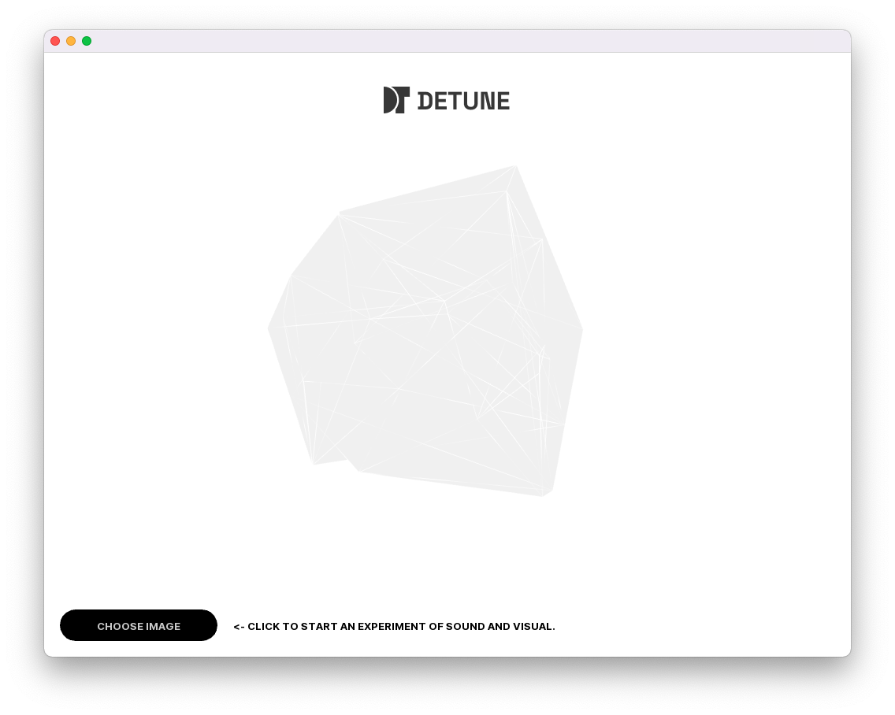
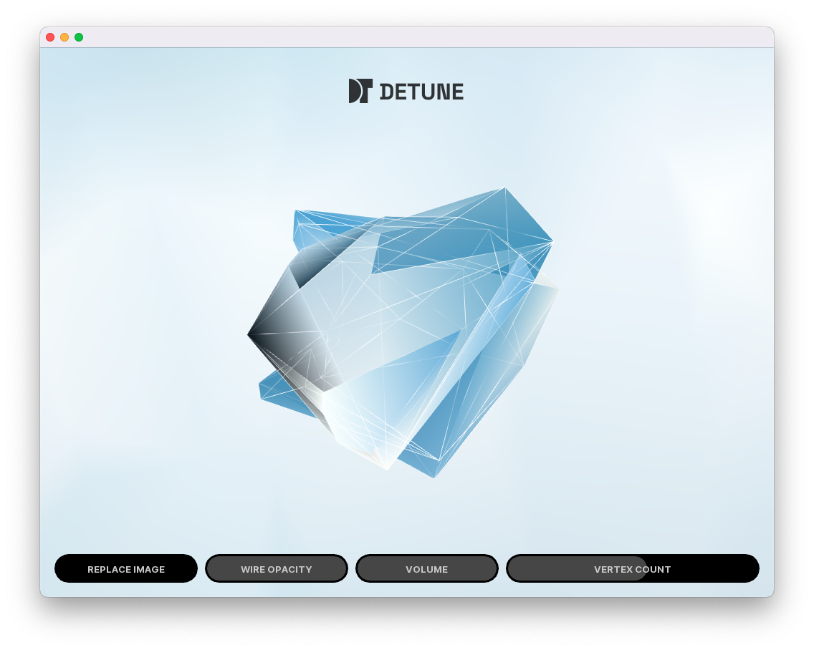
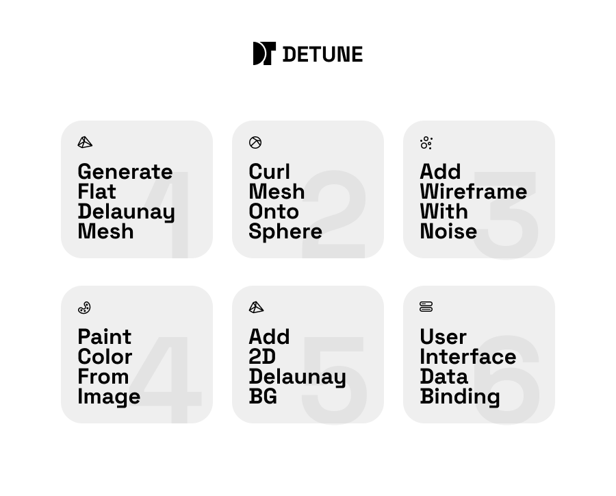
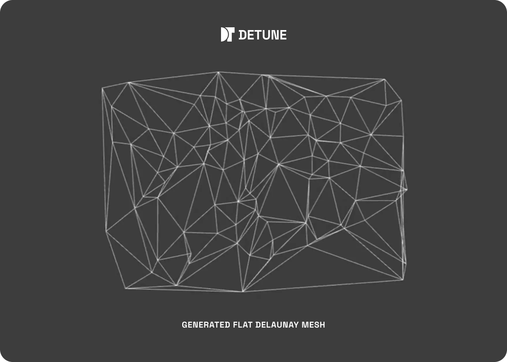
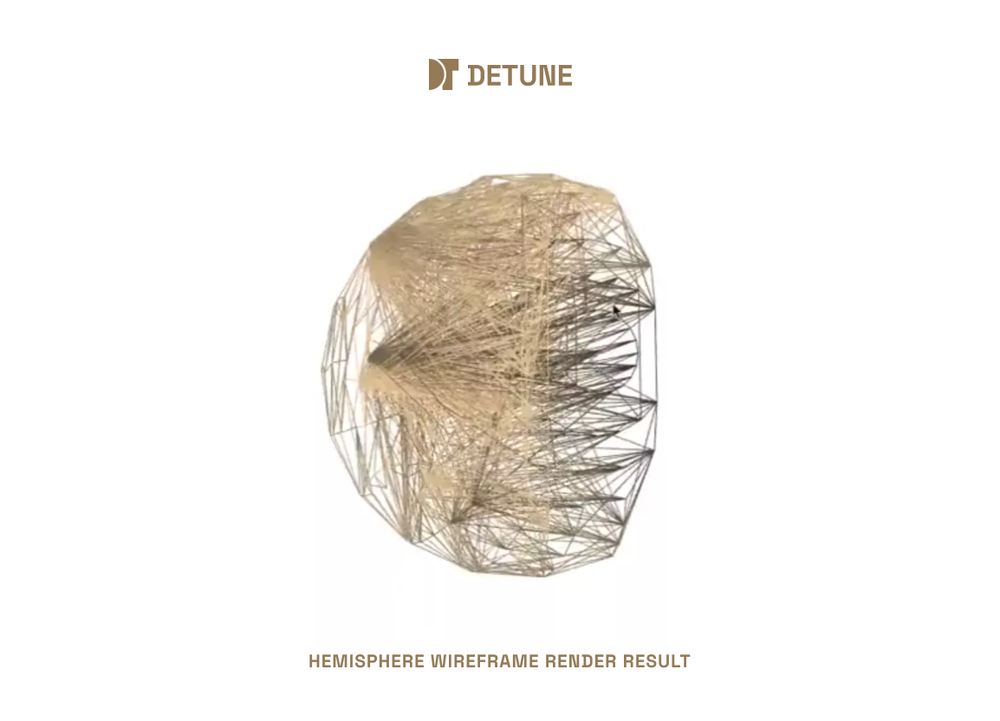
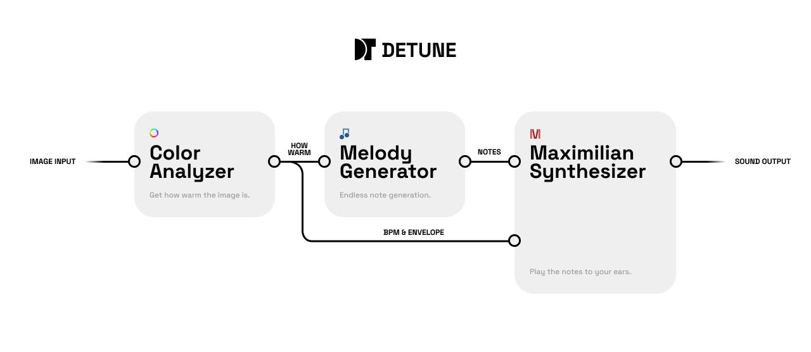

# DeTune Readme file


video presentation：<[https://youtu.be/GfOtX3tNQ1c](https://youtu.be/GfOtX3tNQ1c)>

# DeTune Intro






***DeTune*** is an interactive audio & image experience implemented in openframework, the De in the name comes from the famous vertex triangulation theory - the Delaunay Triangle.

The project is based on  `ofxDelaunay` and  `ofxMaxim` , which derive 3D dynamic effects from the 2D Delaunay algorithm and use the `Maximilian` library to synthesise the audio to interact with it; during the experience, the user can not only upload images to create a unique experience, but also use the visualisation parameters in the UI to adjust the effect they want. 

[https://github.com/obviousjim/ofxDelaunay](https://github.com/obviousjim/ofxDelaunay)

[https://github.com/micknoise/Maximilian/tree/master/cpp/openFrameworks/ofxMaxim](https://github.com/micknoise/Maximilian/tree/master/cpp/openFrameworks/ofxMaxim)

# Delaunay Triangulation

The aim of the Delaunay algorithm is to split points in the plane into multiple triangles while maximising the interior angles of all triangles and avoiding the appearance of a silver triangle.

>In [mathematics](https://en.wikipedia.org/wiki/Mathematics) and [computational geometry](https://en.wikipedia.org/wiki/Computational_geometry), a **Delaunay triangulation** (also known as a **Delone triangulation**) for a given set **P** of [discrete points](https://en.wikipedia.org/wiki/Isolated_point) in a general position is a [triangulation](https://en.wikipedia.org/wiki/Point-set_triangulation) DT(**P**) such that no point in **P** is inside the [circumcircle](https://en.wikipedia.org/wiki/Circumcircle#Triangles) of any [triangle](https://en.wikipedia.org/wiki/Triangle) in DT(**P**). Delaunay triangulations maximize the minimum angle of all the angles of the triangles in the triangulation; they tend to avoid [sliver triangles](https://en.wikipedia.org/wiki/Sliver_triangle). The triangulation is named after [Boris Delaunay](https://en.wikipedia.org/wiki/Boris_Delaunay) for his work on this topic from 1934.[[1]](https://en.wikipedia.org/wiki/Delaunay_triangulation#cite_note-Delaunay1934-1)
>--*wikipedia*

---


# Visual section - 3D Delaunay polyhedra

The main body of DeTune consists of a dynamic 3D Delaunay polyhedron based on the  `ofxDelaunay` library and a 2D Delaunay triangulated background image.

When the program starts, a grey Delaunay polyhedron is created in the default interface by editing the  `Vertex shader`  and  `Frag shader`  from the 2D version of the Delaunay triangulation mesh; after the participant uploads an image, the program modifies the vertex colour in the mesh according to the image information to influence the visual effect of the polyhedron. At the same time, it adds a 2D Delaunay triangulated background image.


## Implementation Details

### 1、Generate Flat Delaunay Mesh

Based on work already done in the  `ofxDelaunay`  library, it is very easy to Delaunay triangulates the randomly generated vertices and output a TriangleMesh with the vertex index for rendering and colouring.

```c++
for (int i=0; i< countVal; i++)
{
    float x = ofRandom(1024);
    float y = ofRandom(1024);
    float z = ofRandom(200) + 700;
    ofPoint randomPoint(x, y, z);
    delaunay.addPoint(randomPoint);
}
delaunay.triangulate();
```




### 2、Curl Mesh Onto Sphere

As  `ofxDelaunay`  is a 2D version of the Delaunay algorithm, in order to generate a more visually pleasing Delaunay polyhedron, it needs to be figured out how to map it in 3D space.

Initially an attempt was made to apply the Delaunay algorithm directly to spherical coordinates, but after practice it was found that this produced the following effect:

After analysing the principle of Delaunay's algorithm, it was found that because the order of indices created between vertices is ordered by x-coordinate from smallest to largest, an internal concatenation is created. 

(Thanks to Paul Bourke's paper for its role in the process)

[http://paulbourke.net/papers/triangulate/](http://paulbourke.net/papers/triangulate/)

So instead, the solution is to modify the vertex coordinates from the shader: curl the plane into a sphere and rotate it in space:

```c++
vec4 spos;
float r = (position.z - 700.0) * noise(varyingtexcoord * 17.0 + vec2(time * 2.0, 0.0)) *  noisevalue + 700.0;
spos.x = r * sin(position.x / 1024.0 * PI * 2.0) * cos(position.y / 1024.0 * PI * 2.0);
spos.y = r * sin(position.x / 1024.0 * PI * 2.0) * sin(position.y / 1024.0 * PI * 2.0);
spos.z = r * cos(position.x / 1024.0 * PI * 2.0);
spos.w = position.w;
```

The vertices are rotated about the x-axis.

```c++
//X rotate
float cosRY = cos(time * 25./360. * PI * 2.);
float sinRY = sin(time * 25./360. * PI * 2.);

float tempz = spos.z;
float tempx = spos.x;

spos.x = (tempx * cosRY) + (tempz * sinRY);
spos.z = (tempx * -sinRY) + (tempz * cosRY);

gl_Position = modelViewProjectionMatrix * spos;
```
### 3、Add Wireframe With Noise

To achieve the "flow" effect in the wireframe.

```c++
float rand(vec2 n) { 
    return fract(sin(dot(n, vec2(12.9898, 4.1414))) * 43758.5453);
}

float noise(vec2 p){
    vec2 ip = floor(p);
    vec2 u = fract(p);
    u = u*u*(3.0-2.0*u);
    
    float res = mix(
        mix(rand(ip),rand(ip+vec2(1.0,0.0)),u.x),
        mix(rand(ip+vec2(0.0,1.0)),rand(ip+vec2(1.0,1.0)),u.x),u.y);
    return res*res;
}

void main()
{
    // cusColor.rgb
    outputColor = vec4(vec3(1.0), wirevalue * noise(varyingtexcoord * 20.0 + vec2(time * 5.0, 0.0)));//texture(tex0, varyingtexcoord);
}
```

### 
### 4、Paint Color From Image & Add 2D Delaunay Background

By default,  `ofMesh`  generates the colour of the rendered surface based on the vertex colour, so the image can be mapped in the primitive directly by modifying the vertex colour.

```c++
float width = img.getWidth();
float height = img.getHeight();

ofMesh &mesh = delaunay.triangleMesh;

for (int i = 0; i < mesh.getNumVertices(); i++) {
    ofVec3f vertex = mesh.getVertex(i);
    vertex.x /= 1024.0;
    vertex.y /= 1024.0;

    ofColor col = img.getColor(floor(vertex.x * width), floor(vertex.y * height));
    mesh.setColor(i, col);
}
```

### 5、User Interface Data Binding

Added image upload function and some visual adjustment parameters to the UI: wireframe opacity, volume, amount of generated vertices.

(using the Button drawing code provided in <[https://gist.github.com/dringz/0d65e89fbcfba4a142a3af8b6f581d5a](https://gist.github.com/dringz/0d65e89fbcfba4a142a3af8b6f581d5a)>)

```c++
font.load("Inter-Bold.ttf", 10);

loadDButton.setup(20, ofGetWindowHeight() - 60, 200, 40, "CHOOSE IMAGE");
loadDButton.font = &font;

wireSlider.setup(230, ofGetWindowHeight() - 60, 200, 40, "WIRE OPACITY");
wireSlider.font = &font;
wireSlider.setValue(1);
wireSlider.hide = true;

volumeSlider.setup(440, ofGetWindowHeight() - 60, 200, 40, "VOLUME");
volumeSlider.font = &font;
volumeSlider.setValue(1);
volumeSlider.hide = true;

countSlider.setup(650, ofGetWindowHeight() - 60, ofGetWindowWidth() - 650 - 20, 40, "VERTEX COUNT");
countSlider.font = &font;
countSlider.min = 20;
countSlider.max = 60;
countSlider.step = 4;
countSlider.setValue(lastCount);
countSlider.hide = true;

logo.load("detune_logo.png");
```


---


# Audio section - generated music from picture information

Once the image is loaded into DeTune, the participant not only sees a visually distinctive Delaunay polyhedron, but also hears a synthesiser melody associated with the characteristics of the image.

The characteristics of these melodies are determined by the Warmness of the image extracted by the Analyzer, followed by a continuous output of musical notes from the Melody Generator and finally played in real time by the Maximilian synthesiser.


## Implementation Details

### 1、Analyzer: Get the warmness of the picture

After the participant has selected the image, the program will randomly sample colours on the image based on the previously generated mesh. The Warmness is averaged across all the sampled colours and this value determines the way the program plays the resulting melody.

The Warmness is calculated from the hue of the colour, with colours closer to blue having a lower warmness and vice versa. The warmness is calculated as follows.

```c++
// 0 for coldest, 1 for warmest
float ofApp::getColorWarmness(ofColor color) {
    return abs(161 - color.getHue()) / 128.0;
}
```

Once the warmness has been calculated, the analyser will simultaneously set the envelope curve used by the synthesiser. Warm pictures will be played with a piano-like envelope curve, more energetic and rhythmic, while cold pictures will be played with a string-like envelope curve, more calm and long.

```c++
if (warmness > 0.5) {
    envelope.setAttack(10);
    envelope.setDecay(beatLength * 0.3);
    envelope.setSustain(0.8);
    envelope.setRelease(beatLength * 0.5);
} else {
    envelope.setAttack(beatLength * 0.35);
    envelope.setDecay(beatLength * 0.3);
    envelope.setSustain(0.65);
    envelope.setRelease(beatLength * 0.35);
}
```

Finally, the analyser also sets the speed at which the melody is played according to its warmth.

```c++
clock.setTempo(ofLerp(30, 220, warmness));
```

### 2. Melody generator: Music notes generated by the program

The melody generator generates a constant stream of new notes for the synthesiser to play.

The note generation code is as follows, where  `currentNote`  is the note number (0 to 6) within the tune, and when it is -1, no sound will be produced.

```c++
double r = ofRandom(0, 1);
if (r > 1 - upPos) {
    currentNote += (r - 1 + upPos) > 0.35 ? 2 : 1;
    currentNote = ofClamp(currentNote, 0, 7);
} else if (r > 1 - upPos - downPos) {
    currentNote -= (r - 1 + upPos + downPos) > 0.35 ? 2 : 1;
    currentNote = ofClamp(currentNote, 0, 7);
} else if (r > 0.1) {
    // Keep pitch
} else if (r > 0.05) {
    currentNote = currentNote + 3 > 7 ? currentNote - 3 : currentNote + 3;
    currentNote = ofClamp(currentNote, 0, 7);
} else {
    currentNote = -1;
}
```

The  `upPos`  and  `downPos`  in the code are the up and down probabilities of notes generated based on warmness, that are calculated by:

```c++
float upPos = ofLerp(0.15, 0.45, warmness);
float downPos = 0.6 - upPos;
```

Ultimately, the generated notes are supplied to the synthesiser for the actual waveform generation.

### 3. Synthesizer: playing melodies "from pictures"

The notes produced from the melody generator are played using sine waves of 4 different frequencies.

```c++
double ofApp::getSound(double freq) {
    return oscillator1.sinewave(freq) * 0.4 + oscillator2.sinewave(freq * 2) * 0.3 + oscillator3.sinewave(freq * 3) * 0.15 + oscillator4.sinewave(freq * 4) * 0.05;
}
```

The acquired waveform will be output to both channels simultaneously applying the envelope curves previously set by the analyser.

```c++
float env;
env = envelope.adsr(1.0, clock.playHead % 2 == 0);

double freq = currentNote >= 0 ? scaleFreq[currentNote] : 0;
output[i * outChannels] = getSound(freq) * 0.8 * env * (imgLoaded ? 1.0 : 0.0) * volumeSlider.getValue();
output[i * outChannels + 1] = output[i * outChannels];
```

Finally, these sounds will reach the participant's ears through the device's speakers or headphones, providing a personalised audio-visual experience with the dynamically changing Delaunay polyhedra.

